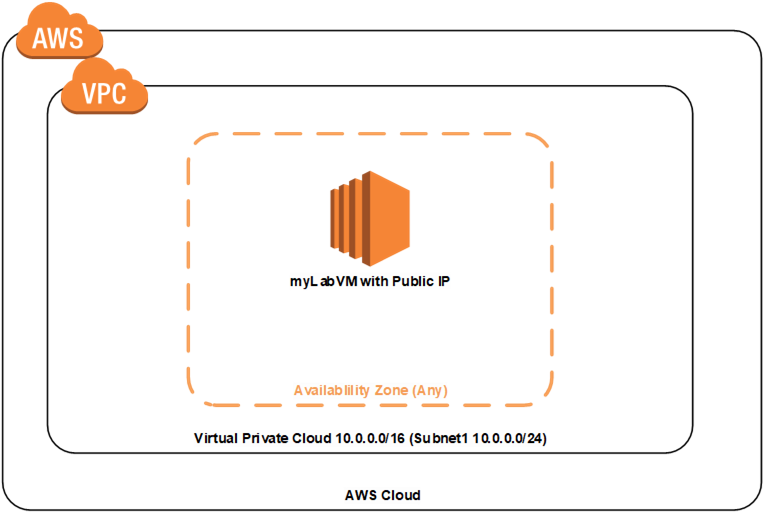

### go deploy - AWS Content Developer Technical Assessment

As part of the role of a Content Developer, you will be required to create templates to pre provision resources for students to carry out labs more efficiently.  We also use IAM Policies to ensure only the actions required for the lab are permitted.

To give an example, many labs for an AWS SysOps course include using EC2 instances.  Imagine Module 1  and Module 2 labs get students to create EC2 instances, that's fine.  Now imagine Module 12 and you have to create ANOTHER instance.  *Yawn.*  Instead we deploy the EC2 and require VPC instance for them.  Based on the IAM policy the user account we allocate the student/user is only permitted to manage EC2 and VPCs.

This is a simple scenario, we could deploy far more complex scenarios, however, for this technical assessment, you are required to create a new user called **User1**, a **Cloud Formation Template** to deploy the resources below and an **IAM Policy** to restrict the student/user from doing anything other than Create/Manage/View EC2 instances and VPCs.

Once you have completed the task please email your interviewer.  The work will then be assessed and feedback given within 24 hours.

**Additional Notes**

1.  Pick any _reasonable_ size VM
1.  Use the VPC and subnet IP Range from the diagram above